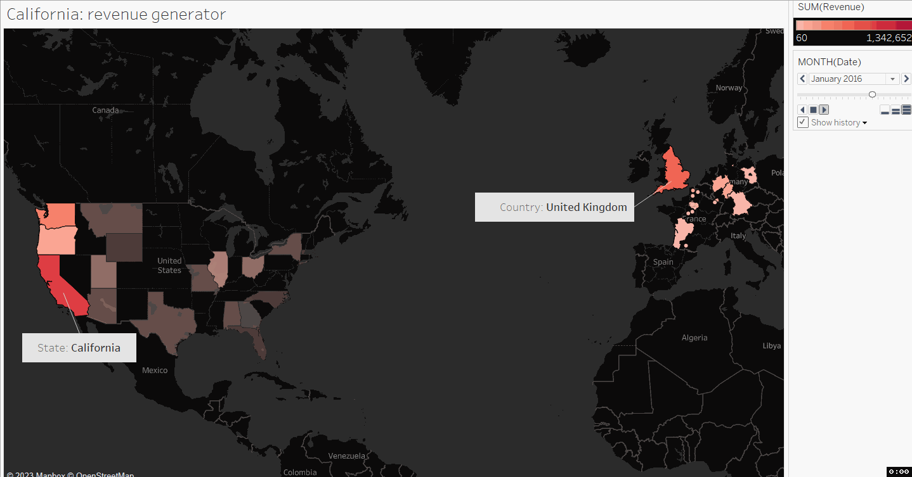

This repo consists of a short project of analysing bike sales from a anonymous company.
The dataset is acquired from [kaggle](https://www.kaggle.com/datasets/thedevastator/analyzing-customer-spending-habits-to-improve-sa).

This project started with a basic analysis and cleaning using MYSQL, including quick overview of distribution between categories/sub-categories, and creation of new columns when appropriate.

The second step was performing visualization and finding the cause of revenue increase by using [Tableau](https://public.tableau.com/views/bikesalesanalysis_16728519380800/Distributionsofunitpricesacrossproductcategories_?:language=en-GB&publish=yes&:display_count=n&:origin=viz_share_link)

Finally, statistical tests were performed to determine the realtion between spending insights of suspicion.
